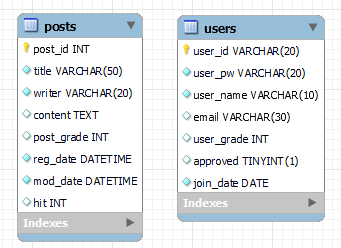
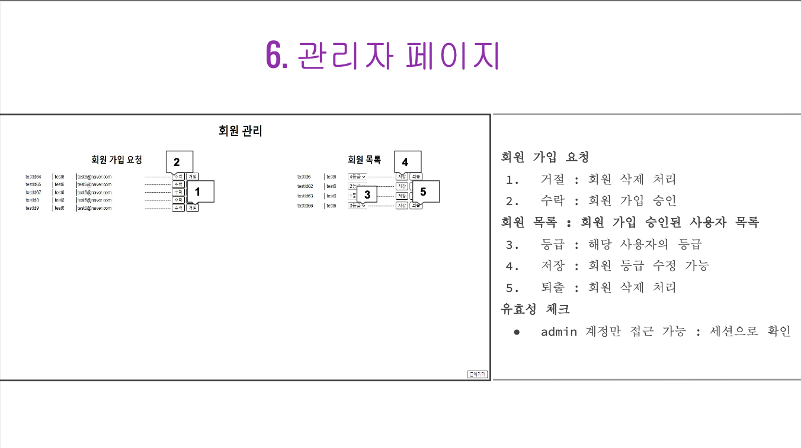

## 목차
- [프로젝트 정보](#-Best-board)
- [구조](#-구조)
- [주요 관심사](#-주요-관심사)

# 🚀 Best board
## 📌 과제
### 필수 포함
- DB table 2개 이상
- user, admin page 별도 생성

## 🔧 사용 기술 및 개발 환경
Eclipse, Java 17, MySQL, JSP
## 🔍 소개
&nbsp; 부트캠프 두번째 미니 프로젝트로 **admin 페이지**를 포함한 **게시판**을 구현했습니다. 
### 기능
- 회원
  - 가입
  - 로그인
- 게시글
  - CRUD
- 관리자
  - 회원 가입 요청 승인 및 거절
  - 회원 등급 수정
  - 회원 퇴출
### 기간
3일: 23. 7.19(월) ~ 23. 7.21(일)
### 인원
&nbsp; 강동희, 김훈호, 명원식, 이준희

# 🏗 구조
## 💾 ERD

# 😍 주요 관심사
- **javadoc 문서화**
- **PRG 패턴 준수**
- 유효성 검사
  - 등급에 따라 사용 가능한 기능을 제한하기 위해 **세션** 활용
  
# 개인
## 🤩느낀 점
- **javadoc**을 활용하니 서로의 코드를 읽기 편했습니다.
- **정당한 사용자**인지 확인하는 과정이 **반복**되는 것이 **불편**했습니다.
  - 하지만, 다른 조와 달리 **postman** 으로 타인의 글 **조작**이 블가해 칭찬을 받아 행복했습니다.
- 내 메서드를 다른 사람도 **재사용**할 때 기분이 깨나 좋습니다.
- **git**으로 협업하지 않았는데, 매우 비효율적이었습니다.
- 관리자 화면이 사용하기 편할 것 같다는 이야기를 들어 기분이 좋았습니다. 히히 

  

